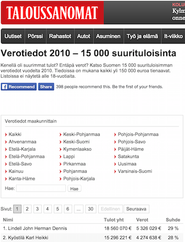

```{r, include=FALSE, echo=FALSE, warning=FALSE, message=FALSE}
pkgs <- c('httr', 'dplyr', 'XML', 'ggplot2', 'stringr', 'car', 'devtools', 'rsdmx', 'stargazer', 'knitr', 'tidyr', 'reshape2', 'sandwich', 'lmtest', 'plm' )
repmis::LoadandCite(pkgs, file = 'packages1.bib')

# set your working directory here
setwd("/Users/Kyle/Dropbox/!Fall_2014/Collab_Data/Final_Project/")

##################################
# Final Assignment: Data Science Course
# Kyle Ott & Cornelius Schneider
# December 12, 2014
##################################

# Load packages
library(httr)
library(dplyr)
library(XML)
library(ggplot2)
library(stringr)
library(car)
library(devtools)
library(rsdmx)
library(stargazer)
library(knitr)
library(tidyr)
library(reshape2)
library(sandwich)
library(lmtest)
library(plm)

load("cleaned.RData")

```

## Welcome to our website!


<br>

**Since 2009, Finland’s largest business online daily newspaper [Taloussanomat](http://www.taloussanomat.fi) publishes the top 15,000 income earners who are 18 years or older. The data includes their name, total income, taxed paid, and their average tax rate.**  



(source: screenshot of [Taloussanomat website](http://www.taloussanomat.fi/verotiedot/2009/suurituloisimmat/))  
<br>
*Until now*, this information has been provided in tables that are in an unsatifactory format. To advance the transparency and openess of the data, we (researchers) have scraped the [raw data](https://github.com/kylejott/Final_Project/blob/master/all.RData) that has so far been published (the years 2009 to 2013) and cleaned it so that you can take a look at all 70,402 tax payer information in one [dataset](https://github.com/kylejott/Final_Project/blob/master/clean.RData).  


<br>
We have reached out to *Taloussanomat*, but have not heard back from them for official comment. **Our purpose for doing this is for academic purposes**, of which we have written a paper entitled *The Top (0.4%) Tail of Finland: A Tale of Incomes, Tax Rates, and Elasticities from 2009 to 2013* which you can find a pdf version [here](https://github.com/kylejott/Final_Project/blob/master/final_paper.pdf).  


<br>
**Our intent for this website, is serve as a portal for information about this dataset on Finland's top income-earners.** All of our code is located in an [open repository](https://github.com/kylejott/Final_Project) of which we welcome others to contribute and make comments. Other than finding links, this website also presents summary information about the dataset, which is lacking on the Taloussanomat website.  


## Data Overview

In a first step we [scraped the data](https://github.com/kylejott/Final_Project/blob/master/data_scraping.R) from the *Taloussanomat* [dedicated website](http://www.taloussanomat.fi/verotiedot/2009/suurituloisimmat/). 
<br>
The variables given by our scraped data are as follows: full name, total income (in euros), total taxes paid (in euros), average tax rate (in percent), and the tax year. The following table provides a quick overview:

```{r echo =FALSE, cache=FALSE, include=TRUE, results='asis', warning=FALSE, error=FALSE, message=FALSE}

load("cleaned.RData")
cleaned2 <- group_by(cleaned, year)

obs_all <- tally(cleaned2)
t1_totinc <- summarise(cleaned2, mean1=mean(total_inc),median1=median(total_inc))
t1_tottax <- summarise(cleaned2, mean2=mean(taxes_paid),median2=median(taxes_paid))
t1_rat <- summarise(cleaned2, mean3=mean(ratio),median3=median(ratio))

t1a <- merge(obs_all, t1_totinc,
             by = c('year'))
t1b <- merge(t1a, t1_tottax,
             by = c('year'))
t1c <- merge(t1b, t1_rat,
             by = c('year'))

load("clean.RData")

obs_all_sum <- tally(clean)
t1_totinc_sum <- summarise(clean, mean1=mean(total_inc),median1=median(total_inc))
t1_tottax_sum <- summarise(clean, mean2=mean(taxes_paid),median2=median(taxes_paid))
t1_rat_sum <- summarise(clean, mean3=mean(ratio),median3=median(ratio))

obs_all_sum$year <- c('All')
t1_totinc_sum$year <- c('All')
t1_tottax_sum$year <- c('All')
t1_rat_sum$year <- c('All')

t1a_sum <- merge(obs_all_sum, t1_totinc_sum,
                 by = c('year'))
t1b_sum <- merge(t1a_sum, t1_tottax_sum,
                 by = c('year'))
t1c_sum <- merge(t1b_sum, t1_rat_sum,
                 by = c('year'))

summarytableTS <- rbind(t1c, t1c_sum)
```
```{r, results='asis', echo=FALSE, error=FALSE, warning=FALSE}
# i cannot figure out how to get better spacing on the label columns
knitr::kable(summarytableTS, align ='c', digits = 0, format='html',
             col.names=c("Year", "# of obs", "Ave Inc", "Median Inc",
                         "Ave Taxes Paid", "Median Taxes Paid",
                         "Ave Tax", "Med Tax"))
```

```{r, results='asis', echo=FALSE, error=FALSE, warning=FALSE}

clean$year2 <- as.character(clean$year)
m <- ggplot(clean, aes(x = ratio, y= ..count.., group=year2))
m + geom_density(aes(colour=year2)) +
  scale_colour_brewer(palette="Set1") +
  theme_bw(base_size = 13) +
  xlab("\nAverage Tax Rate (%)") +
  ylab("Count\n") +
  ggtitle("Observation Counts of Average Tax Rate by Year\n")
```


Plotting income against the average tax rates
```{r, results='asis', echo=FALSE, error=FALSE, warning=FALSE}
qplot(ratio, total_inc, data=clean, ylab  = 'Total Annual Income',
      xlab ='Average Tax Rate', ylim=c(150000,1000000),
      main = "Average Tax Rate and Total Income up to 1,000,000 euros") + theme_bw(base_size = 13)
```
```{r, results='asis', echo=FALSE, error=FALSE, warning=FALSE}
#plot of midding range incomes
qplot(ratio, total_inc, data=clean, ylab  = 'Total Annual Income',
      xlab ='Average Tax Rate', ylim=c(1000000,5000000),
      main = "Average Tax Rate and Total Income from 1 mil. to 5 mil. euros") + theme_bw(base_size = 13)
```
```{r, results='asis', echo=FALSE, error=FALSE, warning=FALSE}
#plot of top incomes
qplot(ratio, total_inc, data=clean, ylab  = 'Total Annual Income',
      xlab ='Average Tax Rate', ylim=c(5000000, 175000000),
      main = "Average Tax Rate and Total Income from 5 mil. to 175 mil euros") + theme_bw(base_size = 13)
```

```{r, include=FALSE, echo=FALSE, warning=FALSE, message=FALSE}
# figure on shares
# clean$total2009 <- with(clean, sum(clean[yr2009==1, "taxes_paid"]))
# clean$total2010 <- with(clean, sum(clean[yr2010==1, "taxes_paid"])) 
# clean$total2011 <- with(clean, sum(clean[yr2011==1, "taxes_paid"]))  
# clean$total2012 <- with(clean, sum(clean[yr2012==1, "taxes_paid"])) 
# clean$total2013 <- with(clean, sum(clean[yr2013==1, "taxes_paid"])) 

# clean$share2009 <- clean$total2009/clean$Total_Tax_Revenue
# clean$share2010 <- clean$total2010/clean$Total_Tax_Revenue 
# clean$share2011 <- clean$total2011/clean$Total_Tax_Revenue 
# clean$share2012 <- clean$total2012/clean$Total_Tax_Revenue 
# clean$share2013 <- clean$total2013/clean$Total_Tax_Revenue 
# since we only have 5 datapoints, easier to graph manually...

share <- c(0.04898281, 0.06022747, 0.06752648, 0.06347982, 0.0770184)
year <- c(2009, 2010, 2011, 2012, 2013)
shares <- data.frame(year, share)

dev.off()
```
```{r, results='asis', echo=FALSE, error=FALSE, warning=FALSE}
qplot(shares$year, shares$share, caption='\n Top 0.4% Share of Total Paid Finnish Taxes', ylim=c(0.04, 0.08), geom='line', ylab='Total Finnish Taxes Share Paid by Top 0.4%\n', xlab='\nYear', 
                     main = 'Share of Total Paid Taxes') + theme_bw(base_size = 13) 
```


```{r, results='asis', echo=FALSE, error=FALSE, warning=FALSE}
clean$year2 <- as.character(clean$year)
m2 <- ggplot(clean, aes(x = log(taxes_paid), y= ..count.., group=year2))
m2 + geom_density(aes(colour=year2)) +
  scale_colour_brewer(palette="Set1") +
  theme_bw(base_size = 13) +
  xlab("\nLog Total Income (Euros)") +
  ylab("Count\n") +
  xlim(8,18)+
  ggtitle("Observation Count of Log Total Income by Year\n")
```


## Final Thoughts 


Our conc   

