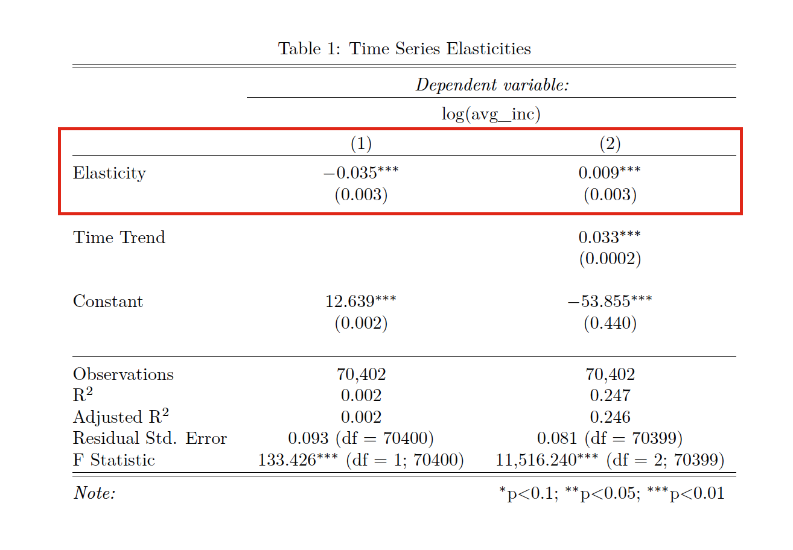
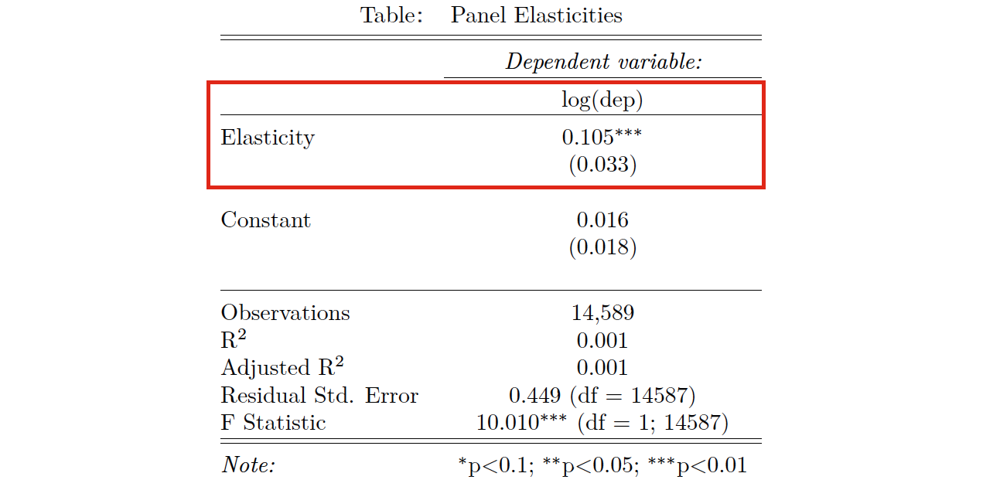

```{r, include=FALSE}
pkgs <- c('httr', 'dplyr', 'XML', 'ggplot2', 'stringr', 'car', 'devtools', 'rsdmx', 'stargazer', 'knitr', 'CausalImpact', 'tidyr', 'reshape2', 'sandwich', 'lmtest', 'plm')
repmis::LoadandCite(pkgs, file = 'packages1.bib')

setwd("/Users/Kyle/Dropbox/!Fall_2014/Collab_Data/Final_Project/")

##################################
# Presentation: Data Science Course
# Kyle Ott & Cornelius Schneider
# 4 December 2014
##################################

# Load packages
library(httr)
library(dplyr)
library(XML)
library(ggplot2)
library(stringr)
library(car)
library(devtools)
library(rsdmx)
library(stargazer)
library(knitr)
library(CausalImpact)
library(tidyr)
library(reshape2)
library(sandwich)
library(lmtest)
library(plm)
```

## Introduction (1)
<style type="text/css">
p { text-align: left; }
</style>

“Optimal” income taxation is always discussed against the background of *classic economic theories*: 

In a very recent work, @piketty2014inequality identify additional reasons why trends in top-income shares are correlated with the tax rates: 

- labor responses
- evasion/avoidance responses
- and bargaining responses. 

<br>
The current debate still lacks information about the top of the income distribution.

Our paper’s purpose is to identify anomalies in the tax patterns of ultra-wealthy Finnish people.

## Introduction (2): Why Finland?
[//]: This figure was creating using CartoDB, here is the link: http://cdb.io/1yVDOcv


## Our data (1)
[//]: This is a screenshot from the taloussanaomat website

@taloussanomat

## Our data (2)

- 70,402 observations (N = ~15,000 ; T = 5)

- Scraped all five years: 2009 to 2013

- Created time series dataset

- Created panel dataset using names as unique id's (N = 4867)

- Variables

    + Name
 
    + Total Income
 
    + Total Taxes Paid
 
    + Average Tax Rate
    
    + Rank

## Share of tax revenue paid by top 0.4%
[//]: creating using loop_best2.R


##
[//]: creating using loop_best2.R


##
[//]: creating using loop_best2.R

 
## Research Question

What is the responsiveness of reported taxable income to changes in average tax rates?

- Our research is motivated by the framework laid down by @gruber2002elasticity, @saez2004reported, and @giertz2007elasticity.

- @gruber2002elasticity and @giertz2007elasticity uses **panel data** to observe income elasticities. @saez2004reported uses **aggregated time series**.

- All of these papers look to observe long-term behavoiral elasticities, but given our dataset, we are only looking for **short-term** elasticies.

## Average tax rates in decile means
[//]: creating using loop_best2.R
 

<br>
(inspired by @riihela2010trends)

## Key Findings (1)
[//]: creating using inferential_stats.R, red box added using Preview


## Key Findings (2)
[//]: creating using inferential_stats.R, red box added using Preview



Model from @giertz2007elasticity

## Conclusion
Limitations:

- Limited expressiveness of average tax rates
- Only short-term elasticities (not long term)
- Lacking variables: marginal tax rates, controlling for other kinds of income, demographic controls, and marital status control
<br>


Further research needed!

- Panel fixed effects model
- Further robustness checks
- Comparison to other Scandinavian countries
- Investigating our counterintuitive result

## References


