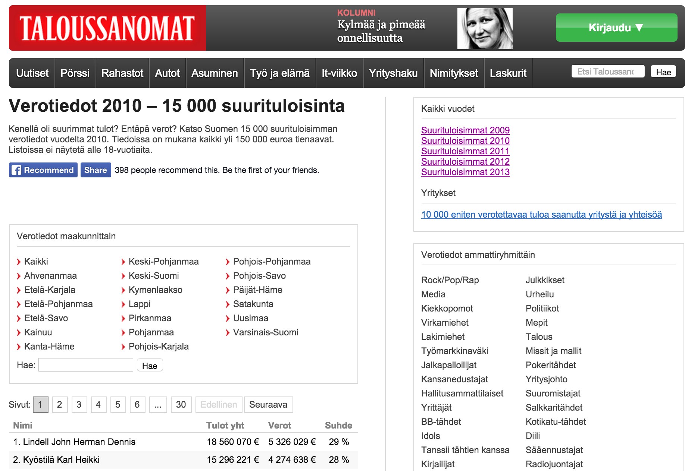

```{r, include=FALSE}
pkgs <- c('httr', 'dplyr', 'XML', 'ggplot2', 'stringr', 'car', 'devtools', 'rsdmx', 'stargazer', 'knitr', 'CausalImpact' )
repmis::LoadandCite(pkgs, file = 'packages1.bib')

setwd("/Users/Kyle/Dropbox/!Fall_2014/Collab_Data/Final_Project/")

##################################
# Presentation: Data Science Course
# Kyle Ott & Cornelius Schneider
# 4 December 2014
##################################

# Load packages
library(httr)
library(dplyr)
library(XML)
library(ggplot2)
library(stringr)
library(car)
library(devtools)
library(rsdmx)
library(stargazer)
library(knitr)
library(CausalImpact)
library(tidyr)
library(reshape2)
library(sandwich)
library(lmtest)
library(plm)
```

## Introduction (1)
<style type="text/css">
p { text-align: left; }
</style>

“Optimal” income taxation is always discussed against the background of *classic economic theories*: 

In a very recent work, @piketty2014inequality identify additional reasons why trends in top-income shares are correlated with the tax rates: 

- labor responses
- evasion/avoidance responses
- and bargaining responses. 

<br>
The current debate still lacks information about the top of the income distribution.

Our paper’s purpose is to identify anomalies in the tax patterns of ultra-wealthy Finnish people.

## 


## Introduction (3): Why Finland?


## Our data (1)


@taloussanomat

## Our data (2)

- 70,402 observations (N = ~15,000 ; T = 5)

- Scraped all five years: 2009 to 2013

- Created time series dataset

- Created panel dataset using names as unique id's (N = 4867)

- Variables

    + Name
 
    + Total Income
 
    + Total Taxes Paid
 
    + Average Tax Rate
    
    + Rank
 
## Research Question


- Bullet 1
- Bullet 2
- Bullet 3

## 


## Initial Findings

## References


