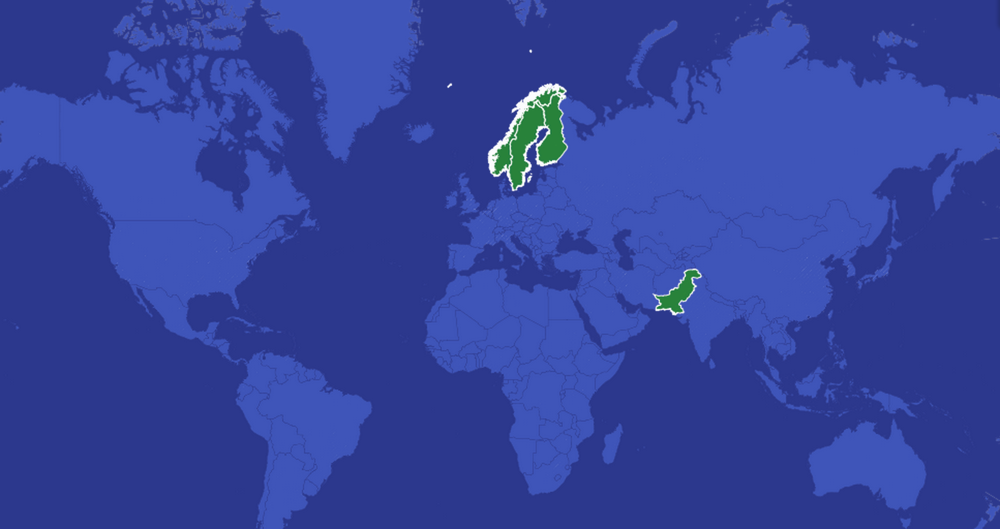

```{r, include=FALSE}
pkgs <- c('httr', 'dplyr', 'XML', 'ggplot2', 'stringr', 'car', 'devtools', 'rsdmx', 'stargazer', 'knitr', 'CausalImpact' )
repmis::LoadandCite(pkgs, file = 'packages1.bib')


##################################
# Presentation: Data Science Course
# Kyle Ott & Cornelius Schneider
# 4 December 2014
##################################

# Load packages
library(httr)
library(dplyr)
library(XML)
library(ggplot2)
library(stringr)
library(car)
library(devtools)
library(rsdmx)
library(stargazer)
library(knitr)
library(CausalImpact)
library(ggmap)
library(raster)
```


## Introduction: Why Finland?




## Our data

this finish website hosts the top income earners and their tax rates:

<http://publicdata.eu/>

## Research Question
<br>
<br>
<br>
- Bullet 1
- Bullet 2
- Bullet 3

## Figures

## Initial Findings

## References


